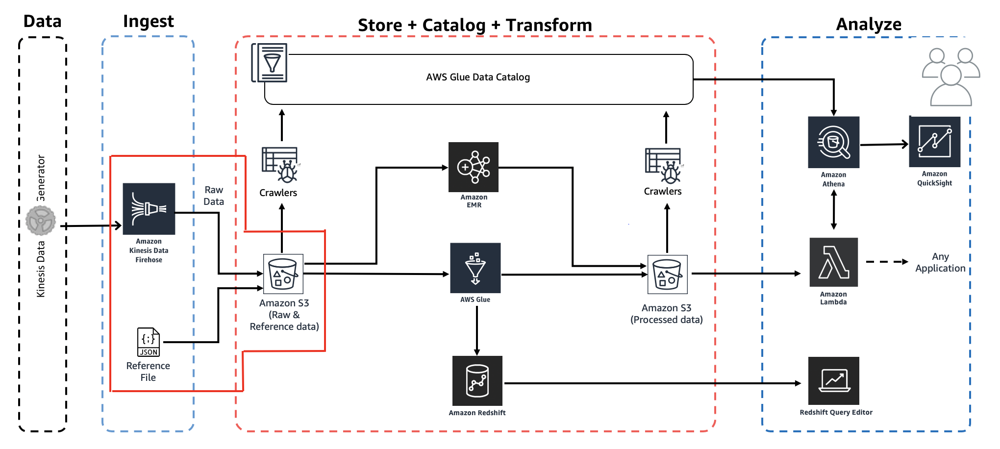

# Workshop: Analytics on AWS

Contributors:

* Vikas Omer | Amazon Web Services | [Linkedin](https://www.linkedin.com/in/vikas-omer/)
* Aneesh Chandra PN | Amazon Web Services | [Linkedin](https://www.linkedin.com/in/aneesh-chandra-



# Pre-requisites:  
* You need to have access to an AWS account with **AdminstratorAccess**
* This lab should be executed in **us-east-1** region
* Best is to **follow links from this  guide** & open them **in new a tab**
* Run this lab in a modern browser

# Ingest and Store

## Create S3 Bucket

In this step, we will navigate to S3 Console and create the S3 bucket used throughout this demo.

Login to AWS Console: https://console.aws.amazon.com/console/home?region=us-east-1

Navigate to S3 Console & Create a new bucket in us-east-1 region :

* GoTo : https://s3.console.aws.amazon.com/s3/home?region=us-east-1
* Click - **Create Bucket**
    * Bucket Name : **yourname-datalake-demo-bucket**
    * Region : **US EAST (N. Virginia)**
    * Click **Create** (bottom left)
* Adding reference data
    * Open - **yourname-datalake-demo-bucket**
        * Click - **Create folder**
            * New folder called : **data**
            * Click - **Save**
    * Open - **data**
        * Click - **Create folder**
            * New folder : **reference_data**
            * Click - **Save**
    * Open - **reference_data**
        * download this file locally : [tracks_list.json](../tracks_list.json)
        * Click - Upload
            * Click **Add files** & upload the **tracks_list.json** file here
            * Click **Upload** (bottom left)


## Create Kinesis Firehose

In this step we will create navigate to Kinesis Console & create a Kinesis Firehose delivery stream to ingest data & store in S3:

* GoTo: https://console.aws.amazon.com/kinesis/home?region=us-east-1#/get-started
* Click **Create Delivery Stream**
    * Step 1: Name and source
        * Delivery stream name : **sg-summit-demo-stream**
        * Source : **Direct PUT or other sources**
        * Click **Next**
    * Step 2: Transform records
        * Record transformation : Disabled
        * Record format conversion: Disabled
        * Click **Next**
    * Step 3: Choose destination
        * Destination : **Amazon S3**
        * S3 bucket : **yourname-datalake-demo-bucket**
        * Prefix : **data/raw/**  (slash **/** after **raw** is important, if you miss it Firehose will copy the data in an undesired location)
        * Error prefix : Leave Blank
        * Click **Next**
    * Step 4: Configure settings
        * S3 buffer conditions: Buffer size: **1** (MB)
        * S3 buffer conditions:  Buffer interval: **60** (sec)
        * S3 compression : **Disabled**
        * S3 encryption : **Disabled**
        * Error logging : **Enabled**
        * Leave everything else default
        * IAM role : Click on **Create new, or Choose**
            * Open a new window, leave everything to default
            * Click - **Allow**
        * Click - **Next**
    * Step 5: Review
        * Review the configuration & make sure its as mentioned above
        * Click - **Create delivery stream**


## Generate Dummy Data

In this step we will configure Kinesis Data Generator to produce fake data and ingest it into Kinesis Firehose

* **Configure Amazon Cognito** for Kinesis Data Generator - In this step we will launch a cloud formation stack that will configure Cognito. This cloudformation scripts launches in **Oregon region** (No need to change this region)
    * Goto : https://console.aws.amazon.com/cloudformation/home?region=us-east-1#/stacks/new?stackName=Kinesis-Data-Generator-Cognito-User&templateURL=https://aws-kdg-tools-us-east-1.s3.amazonaws.com/cognito-setup.json
    * Click - **Next**
    * Specify Details:
        * Username - **admin**
        * Password - **choose a alphanumeric password**
        * Click - **Next**
    * Options:
        * Click - **Next**
    * Review:
        * Scroll down
        * I acknowledge that AWS CloudFormation might create IAM resources: **Check**
        * Click - **Create**
    * Refresh your AWS Cloudformation Console
    * Wait till the stack status changes to **Create_Complete**
        * Select the **Kinesis-Data-Generator-Cognito-User **stack
        * GoTo outputs tab : click on the link that says: **KinesisDataGeneratorUrl** - This will open your Kinesis Data Generator tool
* On Amazon Kinesis Data Generator homepage
    * **Login** with your username & password from previous step
    * **Region: us-east-1**
    * **Stream/delivery stream : sg-summit-demo-stream**
    * Records per second : 2000
    * **Record template  : **In the **big text area**, add the following json template
    * Click - **Send Data - do not click without pasting the below bit of template in the big text area**

Once the tools send ~ 100,000 messages, you can click on - **Stop sending data to Kinesis**

```

{
  "uuid": "{{random.uuid}}",
  "device_ts": "{{date.utc("YYYY-MM-DD HH:mm:ss.SSS")}}",
  "device_id": {{random.number(50)}},
  "device_temp": {{random.weightedArrayElement(
    {"weights":[0.30, 0.30, 0.20, 0.20],"data":[32, 34, 28, 40]}
  )}},
  "track_id": {{random.number(30)}},  
  "activity_type": {{random.weightedArrayElement(
        {
            "weights": [0.1, 0.2, 0.2, 0.3, 0.2],
            "data": ["\"Running\"", "\"Working\"", "\"Walking\"", "\"Traveling\"", "\"Sitting\""]
        }
    )}}
}

```

## Validate that data has arrived in S3

After few moments GoTo S3 console:https://s3.console.aws.amazon.com/s3/home?region=us-east-1

* Click - **yourname-datalake-demo-bucket > Data**
* There should be a folder called **raw** created > Open it and keep navigating, you will notice that firehose has dumped the data in S3 using **yyyy/mm/dd/hh** partitioning 


> Back to [main page](../readme.md)
